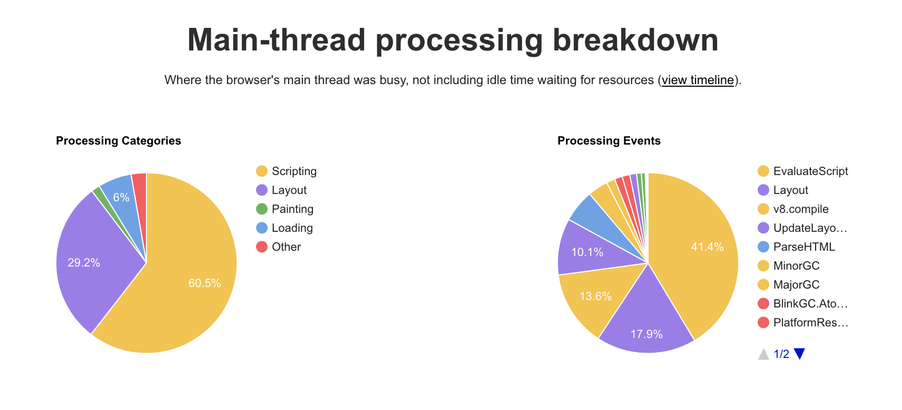
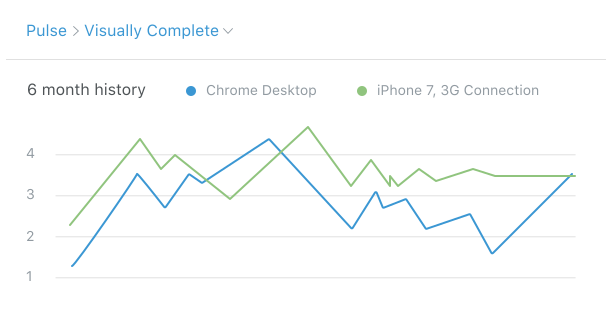

# Making Web Apps & Sites Fast

## Reduce JavaScript

### Choose your npm packages smartly with [BundlePhobia](https://bundlephobia.com/) (Open Source SaaS)

Check sizes of current or future dependencies with [BundlePhobia](https://bundlephobia.com/). Simply enter the name of a npm package, and it will tell you how many downloadable kilobytes it will become, and how long that will take.

#### Example: everyone’s favorite utility library, Lodash

Let’s look at [**the bundle stats for lodash**](https://bundlephobia.com/result?p=lodash@4.17.11):


The first figure we see is the minified bundle size, which is what the user’s browser will parse and execute. A larger amount of code will intuitively on average take a longer time to execute. On a low speed mobile phone, this can be a very noticable effect — in the order of several seconds. If this code is controlling what is displayed on screen, then the user will be waiting until the result is ready.

The minified + gzipped size is the amount that will be downloaded over the network. If you have lots of dependencies like lodash and the other many choices of JavaScript libraries, it total they can added up to many hundreds of kilobytes or even megabytes. While cellular plans are getting larger, many people will have a low limit before they start getting penalized for breaching so be mindful.

The download times give a rough baseline for how long your users will be waiting. You can see that 24.2KB doesn’t sound like much, but it will take roughly half a second to download on a slowish 3G connection. And note that this does not include the time for execution. So someone on a older phone on a slow connection could have a really poor experience of waiting and waiting.

## Measure the experience

### [Lighthouse](https://developers.google.com/web/tools/lighthouse/) (Open Source)


[](https://github.com/GoogleChrome/lighthouse)

Audit performance and accessibility issues with Lighthouse. The same functionality is also available in Google Chrome’s Audits panel.

### [WebPageTest](https://webpagetest.org/easy) (Open Source)

[](https://github.com/WPO-Foundation/webpagetest)

Test how your site performs on Chrome on a Motorola G with **slow 3G** — a 400 Kbps 3G connection with 400ms of latency.

The site might look crude, but it gives you a wealth of information, including detailed request/response waterfall diagrams, screenshots, and even pie charts of the categories of processing on the CPU.



### [Calibre](https://calibreapp.com/) (SaaS)


Track your site’s performance over time. Measure page loading metrics from Lighthouse such as time to first-paint and interactive. Compare the performance between a mobile and desktop device. Set budgets and notify via email or Slack.



### [httpstat](https://github.com/reorx/httpstat) (Open Source CLI)


[](https://github.com/reorx/httpstat)

See durations of:

- domain name lookup into an IP address
- time to establish a TCP connection to that IP address
- how long the TLS handshake of HTTPS took
- the time the server took to respond with data
- and how long that data took to fully transfer to you

```
> httpstat https://collected.guide/
Connected to 13.56.48.87:443 from 0.0.0.0:61669

HTTP/2 200 
date: Sat, 18 Aug 2018 05:44:44 GMT
content-type: text/html; charset=utf-8
content-length: 5685
last-modified: Sun, 12 Aug 2018 23:21:26 GMT

  DNS Lookup   TCP Connection   TLS Handshake   Server Processing   Content Transfer
[     5ms    |      243ms     |     400ms     |       457ms       |        1ms       ]
             |                |               |                   |                  |
    namelookup:5ms            |               |                   |                  |
                        connect:248ms         |                   |                  |
                                    pretransfer:648ms             |                  |
                                                      starttransfer:1105ms           |
                                                                                 total:1106ms 
```


## Improve and compress images

### [Essential Image Optimization Guide](https://images.guide/) (Free)

This guide covers many processes and tools that can reduce image sizes and speed up their decoding to improve the experience for your users.

### [ImageOptim](https://imageoptim.com/) (Free Mac App & Paid SaaS)

Optimize and lossless compress PNGs, SVGs, and JPEGs.

## Optimize web fonts

Custom font are one of the heaviest assets you can ship on a website. Not only can they be a big download, but in the time they take to download they can leave the user seeing no text on the page.

### [Google Guide: Web Font Optimization](https://developers.google.com/web/fundamentals/performance/optimizing-content-efficiency/webfont-optimization) (Free)

> A “full” webfont that includes all stylistic variants, which you may not need, plus all the glyphs, which may go unused, can easily result in a multi-megabyte download.

> The ”race” between the first paint of page content, which can be done shortly after the render tree is built, and the request for the font resource is what creates the ”blank text problem” where the browser might render page layout but omits any text.

## Start loading earlier

- [Preload, prefetch and other `<link>` tags](https://3perf.com/blog/link-rels/)

## Remove or lazily load third party JavaScript

### [Google Guide: Loading Third-Party JavaScript](https://developers.google.com/web/fundamentals/performance/optimizing-content-efficiency/loading-third-party-javascript/)

> Often, performance problems slowing pages down are due to third-party scripts: ads, analytics, trackers, social-media buttons, and so on.

## Cache and fingerprint your assets

### [Google Guide: HTTP Caching](https://developers.google.com/web/fundamentals/performance/optimizing-content-efficiency/http-caching)

> Fetching something over the network is both slow and expensive. Large responses require many roundtrips between the client and server, which delays when they are available and when the browser can process them, and also incurs data costs for the visitor. As a result, the ability to cache and reuse previously fetched resources is a critical aspect of optimizing for performance.
>
> The good news is that every browser ships with an implementation of an HTTP cache. All you need to do is ensure that each server response provides the correct HTTP header directives to instruct the browser on when and for how long the browser can cache the response.

## Experience a slow network for yourself

### [Google Guide: Understanding Low Bandwidth and High Latency](https://developers.google.com/web/fundamentals/performance/poor-connectivity/)

> It's important to understand what using your app or site feels like when connectivity is poor or unreliable. A range of software tools can help you emulate and simulate low bandwidth and high latency.
